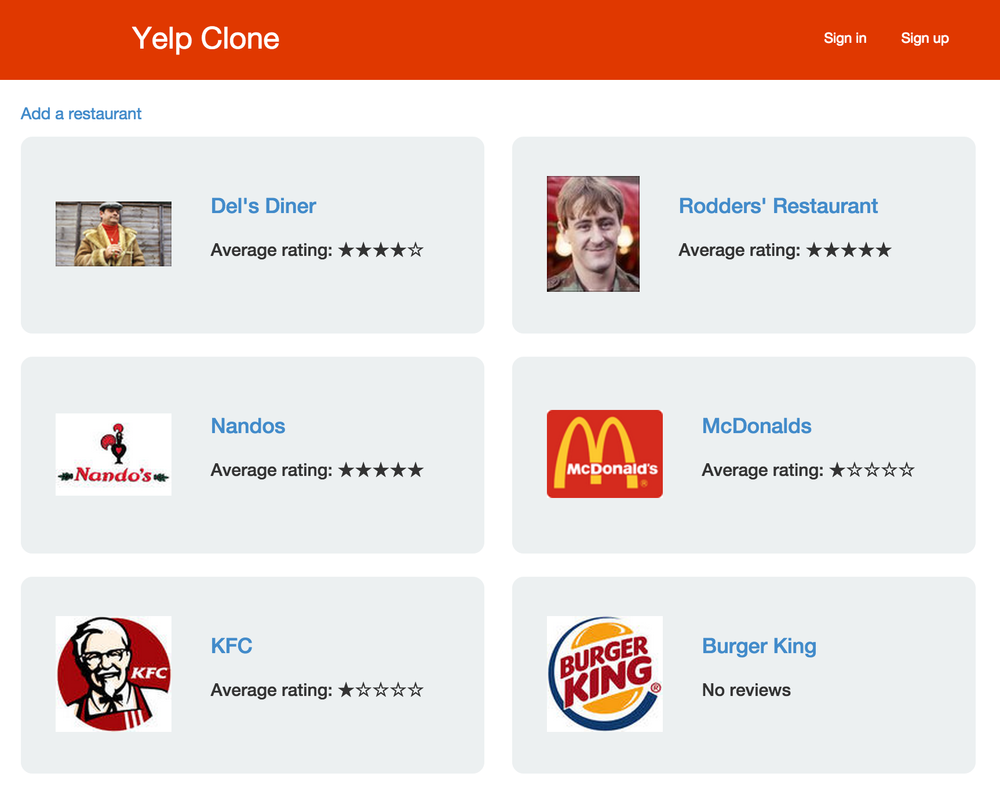
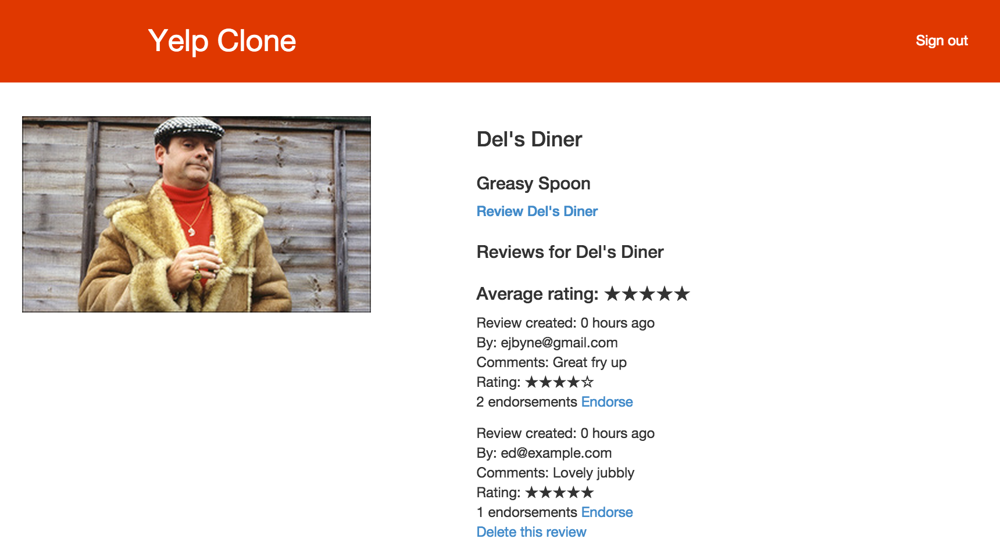

# Yelp Clone (Ruby on Rails)

## Summary

This was our first Ruby on Rails project in Week 8 at Makers Academy, when we built a Yelp clone application.

Through this project we learnt how to create and structure a Rails application using models, views and controllers, together with how to integrate a PostgreSQL database with the ActiveRecord ORM. We used RSpec and Capybara for unit and feature testing.

We used the Devise gem to set up a user authentication system, and also added the ability to sign in with Facebook using the Omniauth gem.

The live version of the application can be accessed [here](https://rails-yelp-clone.herokuapp.com).

## Features

The application includes the following features:

- User can sign up, sign in and sign out (including the option to sign in with Facebook)
- User can add a restaurant (if signed in)
- User can leave a review (if signed in, and only one review per user)
- User can only edit or delete a restaurant/review they've created
- User can endorse a review
- Restaurant page shows individual reviews and average rating
- Option to upload restaurant image (stored on AWS S3)

## Technologies used

- Ruby
- Rails
- PostgreSQL
- ActiveRecord
- RSpec
- Capybara
- Gems: Devise, Omniauth, Paperclip
- ImageMagick
- AWS S3
- Bootstrap
- HTML
- CSS

## Screenshots

### Homepage

### Restaurant review page

